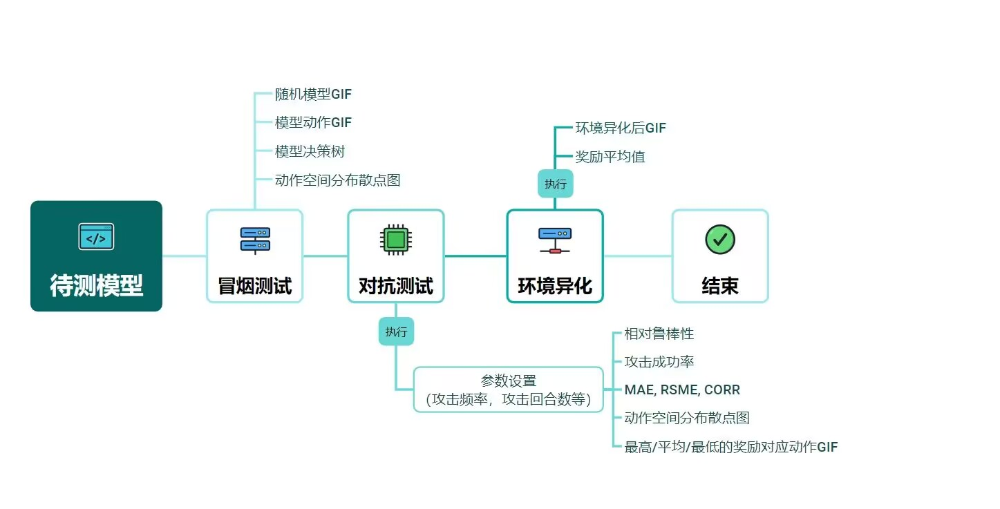
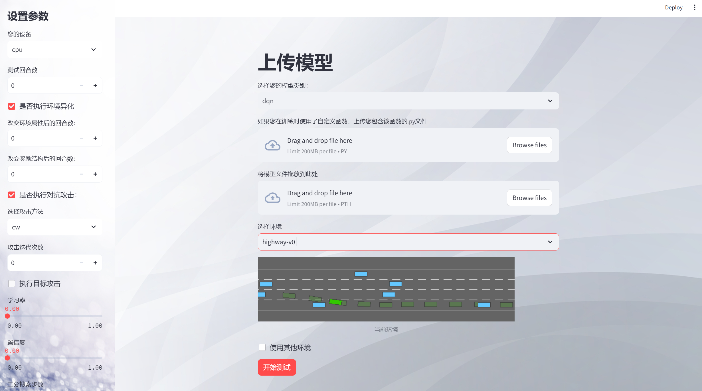

## 什么是 智安 ?

**智安**是一个专为强化学习模型测试而构建的学习平台。

伴随着人工智能赋能各行各业的智能化进程，强化学习因其在复杂环境中优化决策与提升长期效益的能力而成为关键技术。其应用范围广泛，包括工业机器人、自动驾驶、无人机、自然语言处理等领域。然而，强化学习模型的黑盒特性和不确定性使得其安全性变得尤为重要，为响应这一挑战，本作品通过查阅大量文献开发了一个安全测试平台-智安，采用环境异化与梯度优化技术，配合系统化的测试策略和评估指标，致力于提升强化学习模型的可信度和透明度，推动智能化产业的健康发展。

## 整体设计

本平台从模型的鲁棒性、对抗鲁棒性和可解释性三个角度评估强化学习模型的可信度和安全性。


### 模型鲁棒性

该模块针对模型对环境变化的鲁棒性和泛化能力进行测试。强化学习模型的训练环境常常无法完全覆盖真实的现实场景，故而在部署到现实时，会因为现实世界的复杂性而导致性能不佳。鉴于此，我们会从环境变异和负载异化两个角度对模型的鲁棒性进行综合测评。

### 对抗鲁棒性

在具有攻击威胁的对抗场景中，攻击者可能通过各种针对智能体的攻击方法来误导智能体的决策。本模块中，我们充分考虑到真实场景下的各种攻击情景，从对抗样本攻击、模型窃取攻击和后门攻击三种不同的攻击角度，全方位对模型在面对这种场景下的具体行为表现进行测试。

### 模型可解释性

模型的不可解释性在强化学习中尤为突出，因为行为策略的形成过程和决策依据往往是复杂且不透明的。本平台通过模型决策树算法、动作空间分布可视化等多种方式，以可视化模型做出行为的决策依据。

## 测试管理

将不同测试角度模块化，可自定义测试方案，自动生成测试报告。


## 平台优势

- **技术先进**：参考并实现了大量文献中的技术，实现了八种对抗样本生成算法，以及环境异化技术。

- **功能全面**：从多个维度对强化学习模型进行测试，并设计了一套文本的评价指标。

- **开创性**：第一个系统化测试强化学习模型鲁棒性、对抗鲁棒性、可解释性的平台。

- **真实有效**：通过对测试结果进行严格分析，本作品的测试方法有效。

## UI展示



## 快速开始

首先选择您的的模型的训练算法，如dqn、ppo、ddpg等。之后请将您模型的pth文件传入文件接收器，此外如果您在训练的时候使用了外部的自定义函数（例如在ppo模型的训练过程中需要自定义的dist_fn函数） 您需要将包含该函数的python文件传入。例如：

```S
import torch
from torch.distributions import Distribution, Independent, Normal
def dist(*logits: torch.Tensor) -> Distribution:
    return Independent(Normal(*logits), 1)
```

同时为您的模型选择适配的环境，如gymnasium库中的CartPole-v1，Pendulum-v1等，或是基于gymnasium库接口的第三方环境如highway-env。

在页面右侧设置好基本参数如训练设备、测试的回合数等。再根据需求在页面左侧选择是否执行环境异化测试和对抗攻击测试，并依次设置好相关的参数。若您需要环境异化测试，您需要设定环境属性改变后测试的回合数以及在奖励结构改变后的测试的回合数;若您需要对抗测试，请选择具体攻击算法，最后依据不同算法的不同参数需要，设置相关的参数。

最后点击开始测试，进入测试结果页面后，可看到具体的测试进度，并实时显示测试结果。
